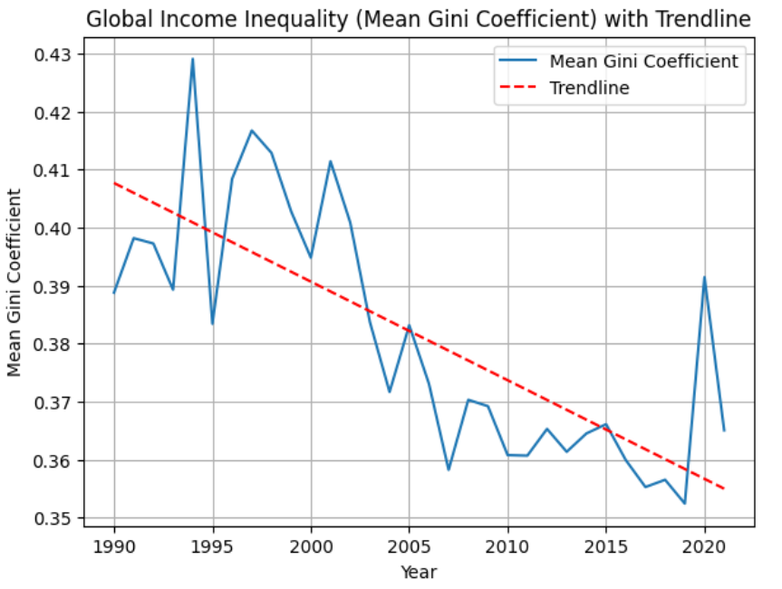
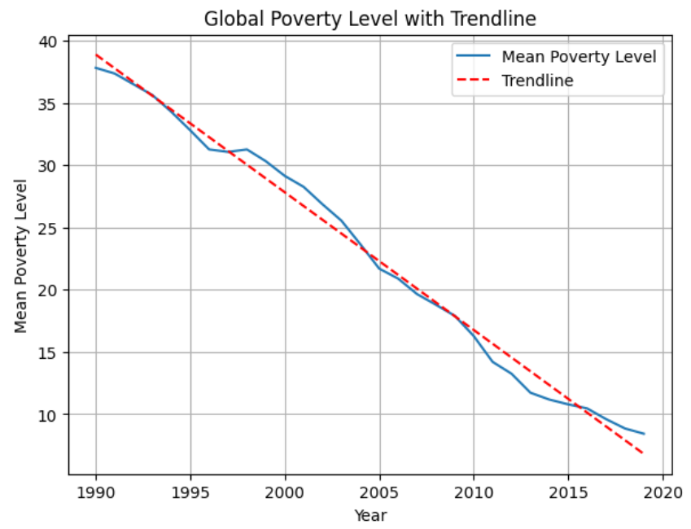
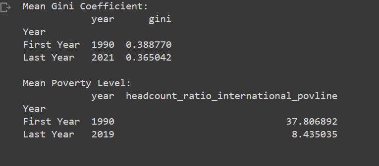

## Global Poverty and Income Inequality Analysis

This repository contains a Jupyter Notebook that analyzes global poverty and income inequality data using Python, Numpy, Pandas, ScikitLearn, and Matplotlib. The notebook visualizes trends in both poverty and income inequality from 1990 onwards, providing insights into the evolution of these socioeconomic issues over time.

The dataset contains information on the [Gini coefficient](#About-the-Gini-Coefficient) and poverty levels for countries across the globe. This data is based on the 2017 purchasing power parity (PPP) version of the dataset.

### [See this project live on Google Collab](https://drive.google.com/file/d/1Dp-e4a5oxXDaKFuXd4s073-0PXZOm9se/view?usp=sharing
)

## Table of Contents

- [Project Structure and Installation](#setup-and-installation)
- [Dataset](#Dataset)
- [Results](#Results)
- [License](#License)

### Setup and Installation
#### Project Structure

- global_poverty_inequality_analysis.ipynb: The main Jupyter Notebook containing the analysis, data processing, and visualization code.
- data.csv: The dataset file containing poverty and income inequality indicators for different countries and regions.

#### Installation

To view and run the Notebook simply visit [Google Collab](https://drive.google.com/file/d/1Dp-e4a5oxXDaKFuXd4s073-0PXZOm9se/view?usp=sharing
)

To run this project locally, follow these steps:

Clone this repository to your local machine using the command:

    bash
    
    git clone https://github.com/yourusername/global-poverty-inequality-analysis.git

Install Python 3.7+ if you haven't already. You can download it from the official Python website.

Create a virtual environment and activate it:

    bash

    python3 -m venv venv
    source venv/bin/activate  # On Windows, use `venv\Scripts\activate`

Install the required packages using pip:

    pip install -r requirements.txt

Launch Jupyter Notebook:

    jupyter notebook

Open the global_poverty_inequality_analysis.ipynb notebook in the Jupyter Notebook interface and run the cells to perform the analysis.

### Dataset
[^](#table-of-contents) 

The dataset used in this project comes from [World Bank poverty data](https://ourworldindata.org/poverty), and provides data on poverty and inequality indicators for various countries and regions.

This data was collected, aggregated, and documented by Joe Hasell and Pablo Arriagada.

[Download The Data On Github](https://github.com/owid/poverty-data)

This analysis uses two attributes from the dataset, the ratio of people under the international poverty line (headcount_ratio_international_povline) and the gini coefficient (gini).

#### About the Gini Coefficient

The Gini coefficient is a measure used to represent income inequality within a population. It ranges from 0 to 1, where 0 represents perfect equality (everyone has the same income) and 1 represents perfect inequality (one person has all the income, while the others have none).

In this analysis the mean Gini coefficient is the average of the Gini coefficients of reporting countries. It provides a single value that gives an idea of the overall income inequality across countries. The higher the mean Gini coefficient, the greater the overall income inequality. Conversely, a lower mean Gini coefficient indicates a more equal distribution of income.

In simpler terms, **the mean Gini coefficient helps us understand how unevenly income is distributed among countries (not individuals)**. It provides a snapshot of income inequality across the globe, allowing us to track changes in inequality over time.

### Results
[^](#table-of-contents) 

The analysis generates the following visualizations:

#### Global Income Inequality (Mean Gini Coefficient) with Trendline

#### Global Poverty Level with Trendline

It also outputs the Mean Gini Coefficient and Mean Poverty Level for the first and last years in the dataset.

### License
[^](#table-of-contents) 

This project is licensed under the MIT License